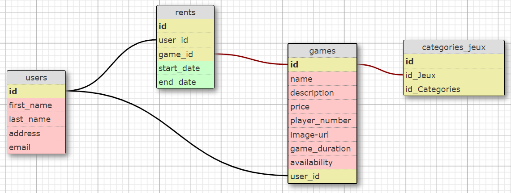
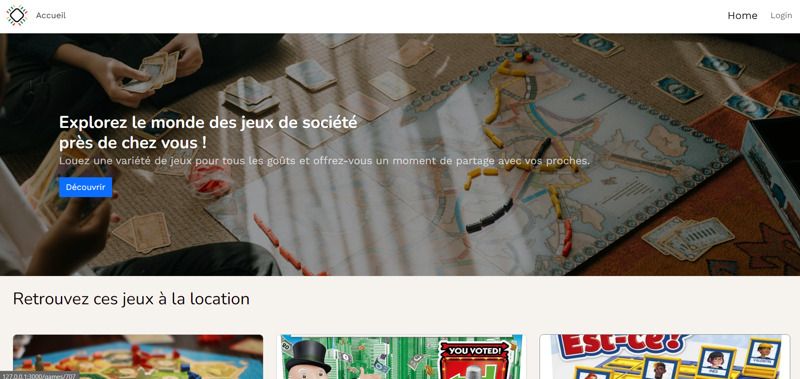
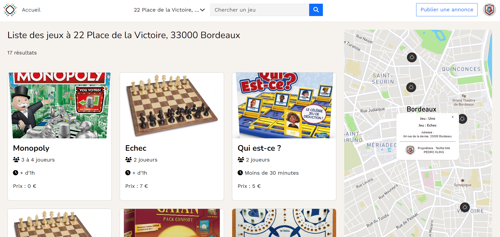
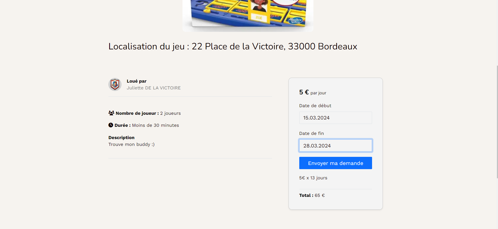
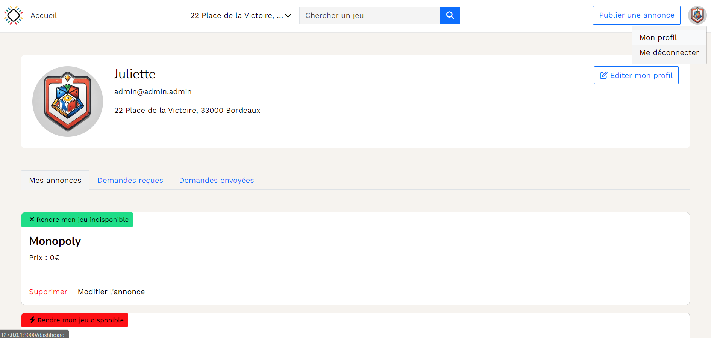

# Jouons

Let’s get back to board games 🎲!

"Jouons" is a website that allows you to rent board games between individuals around your home depending on our geographic area. You can rent a game for a period and the prices are per day.

This project was carried out with two other people as part of my training at Le Wagon school for a week. It's developp on Ruby On Rails framework. We also used Cloudinary for image management, mapbox for dynamic maps and PgSearch for searching by games and address.

During this project, I was more in charge of the back-end part and also of putting the website into production.

## Database schema

We used PostegreSQL to manage our database.

## Screen Shots

• Home page

• The board games search page.
In the menu bar, there is a search bar that allows you to search for a game by name. By unfolding the small arrow next to the address, it is possible to modify its address to obtain the games around it.

• On the details page of a game, a form allows you to enter the rental dates of the game. The price is automatically updated according to the rental duration. You can therefore request a reservation.

• By clicking on the profile, you can access our dashboard. You can see our published announcements, our reservation requests received and sent. We can delete or modify our announcements.

